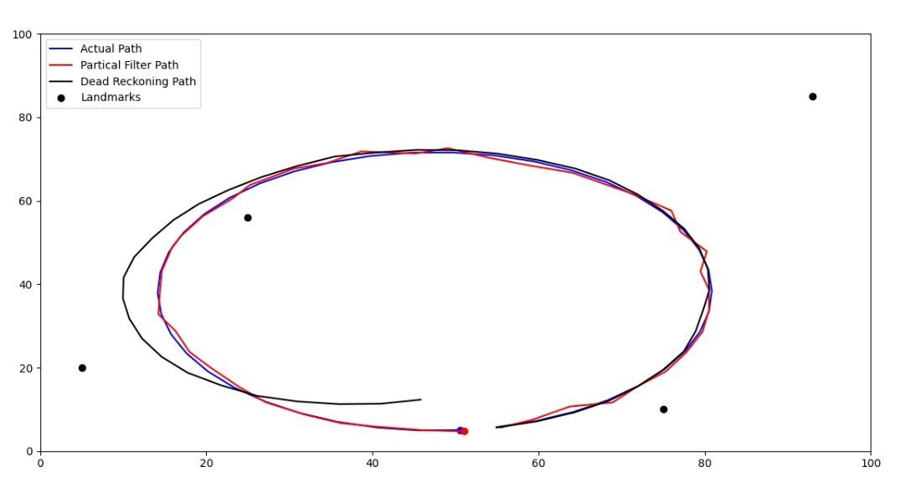

# particle-filters-localization
This project is a simple demonstration of the localization of a mobile robot using particle filter. It uses the recursive bayes filter to estimate the pose of the robot.   
Particle filter easily tackles the situation where the estimated state is non-gaussaian and can have multimodal estimate of the state.   
In this demonstration the robot is supposed to be implementing a circular trajectory. And accordingly, the motion commands are given. 
The robot can measure the distance form a few landmarks to estimate it's position.
### Baye's filter has 2 parts 
- Prediction Step :- predicting the state of the robot solely on the basis of the odometory information and obtaining a belief of it's state (Based on Motion Model).
- Prediction Step :- Correcting the belief of the robot pose by measuring the environment features (Based on Observation Model).

## Particle Filter in Brief
1. Initially robot has no idea where it is in the environment. So, its initial belief about its state is a uniform distribution on the state space.
2. We initialize N number of virtual robot uniformly in the state space having random location and orientation.
3. Robot moves a certain distance and this motion is executed virtually on the virtual robots as well with incorporating the encoder noise.
4. Robot measures the distance from the landmarks, and so does these virtual robots (Simulated Measurements using the map).
5. The degree of similarity between the measurements of the Actual Robot and virtual robot measurements are incorporated using 'importance weights', means if a particular virtual robot's measurement matches to the actual measurement the it will be given a higher weight.
6. In this way we get a new belief distribution. Now we resample the particles.
7. Now N new particles are selected at a probablity proportional to their weight (resampling from the new distribution).
8. step 3 to 7 are repeated till convergence or until the belief reaches a maximum threshold. 

